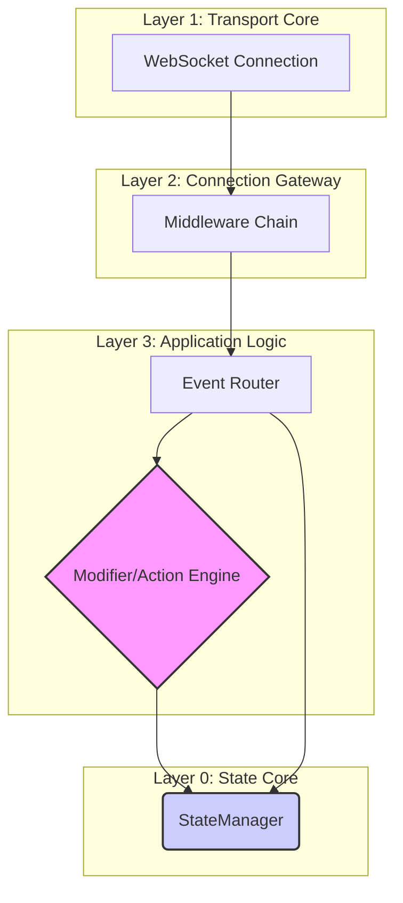

# GoDispatch: Architecture & Design

This document outlines the core principles and layered architecture guiding the development of GoDispatch. Adherence to these rules ensures the project remains modular, testable, and maintainable.

## I. Core Philosophy

1.  **Configuration over Code**: The engine's behavior is driven by external configuration (`config.yaml`). The Go code is an interpreter for this configuration, not a place for hardcoded business rules.
2.  **Explicit over Implicit**: Dependencies and data flow are explicit. We avoid global state and "magical" behavior. A function's signature clearly states what it needs to operate.
3.  **Strict Separation of Concerns**: The system is composed of distinct layers, each with a single, well-defined responsibility. This makes the system easier to reason about, test, and refactor.

## II. Layered Architecture

GoDispatch follows a strict layered architecture. A layer should only communicate with adjacent layers through well-defined interfaces.

#### Layer 0: State Core (`pkg/state`)

- **Responsibility:** To be the single source of truth for all run-time state.
- **Implementation:** The `StateManager` (`state.Manager` interface) manages the lifecycle and relationships of all canonical data objects (`User`, `Connection`, `Room`). It also provides a generic, persistent store for modifier state.
- **Key Principle:** All methods on the `StateManager` are thread-safe. The `InMemoryManager` uses mutexes to protect its internal data structures. The interface-based design allows the in-memory implementation to be swapped with a persistent one (like Redis) in the future without changing other layers.

#### Layer 1: Transport Core (`pkg/transport`)

- **Responsibility:** Manages the raw WebSocket I/O.
- **Implementation:** The `transport.Connection` struct is a wrapper around a single WebSocket connection. It runs dedicated `readPump` and `writePump` goroutines for non-blocking I/O.
- **Key Principle:** This layer is completely stateless. It knows nothing about users, rooms, or application logic; it only knows how to send and receive byte slices.

#### Layer 2: Connection Gateway (`internal/server`)

- **Responsibility:** To guard the HTTP upgrade endpoint and handle the initial connection handshake.
- **Implementation:** A standard Go `http.Handler` middleware chain. Each middleware performs a single task (logging, rate limiting connections, authentication).
- **Key Principle:** The gateway follows a **"Blueprint" pattern**. Middleware validates the incoming request and populates an inert `RequestMetadata` struct. The final `upgradeHandler` receives this validated blueprint and uses it to make a single, atomic change to the `StateManager` (e.g., registering the connection and associating the user).

#### Layer 3: Application Logic (`internal/router`, `internal/engine`)

- **Responsibility:** To process messages from authenticated clients.
- **Implementation:**
    - The **`EventRouter`** receives a message, parses it, and finds the corresponding `CompiledPipeline` from the configuration.
    - The **`Modifier/Action Engine`** executes the pipeline. It first runs the **Modifier chain** (e.g., `rate_limit`, `secure`) to validate the request. If all modifiers pass, it then executes the **Action chain** (`_notify_room`, `_log`, etc.).
- **Key Principle:** The engine is stateless. All stateful operations (like checking a rate limit or sending a message to a room) are performed by calling methods on the `StateManager`.

## III. Key Design Patterns

#### Dependency Injection & Composition Root

- GoDispatch strictly uses **constructor-based dependency injection**. Components receive their dependencies (like loggers or secrets) when they are created.
- The `cmd/go-dispatch/main.go` file acts as the **Composition Root**. It is the *only* place where concrete dependencies are instantiated and wired together. This makes the rest of the application highly modular and testable.

#### The `pipeline.Cargo` Struct

- This struct is the "work order" that flows through the modifier and action pipelines.
- It is created by the `EventRouter` for each incoming message and contains all the context necessary for any modifier or action to do its job: the originating `User`, the `Connection`, the `StateManager`, the raw `Payload`, and any validated `TokenClaims`.

#### Modifier State Management & Garbage Collection

- To support stateful modifiers (`rate_limit`) while keeping the `User` domain model clean, modifier state is decoupled.
- The `StateManager` maintains a separate, top-level store for all modifier state.
- **Garbage Collection:** To prevent memory leaks from expired state (e.g., an old rate limit window), modifiers that create temporary state use `time.AfterFunc`. This schedules a call to the `StateManager`'s `DeleteModifierState` method, ensuring that temporary state is automatically and efficiently cleaned up exactly when it expires, without requiring a global "janitor" process.

## IV. Package Organization

- **`pkg/`**: Contains generic, reusable libraries that are decoupled from the main application logic (e.g., `state`, `transport`, `config`). These could theoretically be used in other projects.
- **`internal/`**: Contains all private application logic specific to the GoDispatch service itself (e.g., the `server` setup, the `router`, and the concrete implementations in `engine`). Code in `internal` cannot be imported by external applications.
